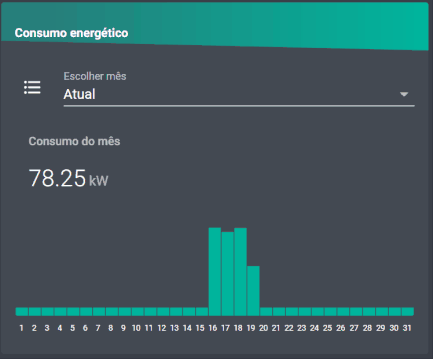

# Home Assistant - Energy consumption graph



## Introduction
Tested in HA version 0.107.4
This implementation allows HA to save the energy consumption of the entire day. It saves in a json file and can save for several years

**To change between months with the `input_select`, this only allows for Portuguese and English month languages. If you want another language, use one `input_select` calling this `input_select`**

## Requirements
- **[lovelace cards]** [mini-graph-card](https://github.com/kalkih/mini-graph-card)
- **[lovelace cards]** [card-mod](https://github.com/thomasloven/lovelace-card-mod)
- Sensor that measures the house consumption and resets everyday, example: [utility_meter](https://www.home-assistant.io/integrations/utility_meter/)
- Place python files into `/config/python_scripts/` directory
- Please ensure you have the json file created `/config/data/energy_daily_simples_kw.json`
- The below code should be added too

### HA Code
#### HA
```
sensor:
  ## Sum of all days to show in graph by default
  - platform: template
    sensors:
      energy_month_consumption_kw:
        friendly_name: "Consumo mensal"
        unit_of_measurement: "kW"
        value_template: >
          {{ (states.sensor.energy_kw_day_01.state | float + 
             states.sensor.energy_kw_day_02.state | float + 
             states.sensor.energy_kw_day_03.state | float + 
             states.sensor.energy_kw_day_04.state | float + 
             states.sensor.energy_kw_day_05.state | float + 
             states.sensor.energy_kw_day_06.state | float + 
             states.sensor.energy_kw_day_07.state | float + 
             states.sensor.energy_kw_day_08.state | float + 
             states.sensor.energy_kw_day_09.state | float + 
             states.sensor.energy_kw_day_10.state | float + 
             states.sensor.energy_kw_day_11.state | float + 
             states.sensor.energy_kw_day_12.state | float +
             states.sensor.energy_kw_day_13.state | float +
             states.sensor.energy_kw_day_14.state | float + 
             states.sensor.energy_kw_day_15.state | float + 
             states.sensor.energy_kw_day_16.state | float + 
             states.sensor.energy_kw_day_17.state | float + 
             states.sensor.energy_kw_day_18.state | float + 
             states.sensor.energy_kw_day_19.state | float +
             states.sensor.energy_kw_day_20.state | float + 
             states.sensor.energy_kw_day_21.state | float + 
             states.sensor.energy_kw_day_22.state | float +
             states.sensor.energy_kw_day_23.state | float +
             states.sensor.energy_kw_day_24.state | float + 
             states.sensor.energy_kw_day_25.state | float + 
             states.sensor.energy_kw_day_26.state | float + 
             states.sensor.energy_kw_day_27.state | float + 
             states.sensor.energy_kw_day_28.state | float + 
             states.sensor.energy_kw_day_29.state | float +
             states.sensor.energy_kw_day_30.state | float + 
             states.sensor.energy_kw_day_31.state | float ) | round(2) }}
  ## 31 days (calling the script)
  - platform: command_line
    name: energy_kw_day_01
    command: python3 /config/python_scripts/energy_daily_simples_read_values.py {{states.input_select.energy_daily_graph_select.state}} 1
  - platform: command_line
    name: energy_kw_day_02
    command: python3 /config/python_scripts/energy_daily_simples_read_values.py {{states.input_select.energy_daily_graph_select.state}} 2
  - platform: command_line
    name: energy_kw_day_03
    command: python3 /config/python_scripts/energy_daily_simples_read_values.py {{states.input_select.energy_daily_graph_select.state}} 3
  - platform: command_line
    name: energy_kw_day_04
    command: python3 /config/python_scripts/energy_daily_simples_read_values.py {{states.input_select.energy_daily_graph_select.state}} 4
  - platform: command_line
    name: energy_kw_day_05
    command: python3 /config/python_scripts/energy_daily_simples_read_values.py {{states.input_select.energy_daily_graph_select.state}} 5
  - platform: command_line
    name: energy_kw_day_06
    command: python3 /config/python_scripts/energy_daily_simples_read_values.py {{states.input_select.energy_daily_graph_select.state}} 6
  - platform: command_line
    name: energy_kw_day_07
    command: python3 /config/python_scripts/energy_daily_simples_read_values.py {{states.input_select.energy_daily_graph_select.state}} 7
  - platform: command_line
    name: energy_kw_day_08
    command: python3 /config/python_scripts/energy_daily_simples_read_values.py {{states.input_select.energy_daily_graph_select.state}} 8
  - platform: command_line
    name: energy_kw_day_09
    command: python3 /config/python_scripts/energy_daily_simples_read_values.py {{states.input_select.energy_daily_graph_select.state}} 9
  - platform: command_line
    name: energy_kw_day_10
    command: python3 /config/python_scripts/energy_daily_simples_read_values.py {{states.input_select.energy_daily_graph_select.state}} 10
  - platform: command_line
    name: energy_kw_day_11
    command: python3 /config/python_scripts/energy_daily_simples_read_values.py {{states.input_select.energy_daily_graph_select.state}} 11
  - platform: command_line
    name: energy_kw_day_12
    command: python3 /config/python_scripts/energy_daily_simples_read_values.py {{states.input_select.energy_daily_graph_select.state}} 12
  - platform: command_line
    name: energy_kw_day_13
    command: python3 /config/python_scripts/energy_daily_simples_read_values.py {{states.input_select.energy_daily_graph_select.state}} 13
  - platform: command_line
    name: energy_kw_day_14
    command: python3 /config/python_scripts/energy_daily_simples_read_values.py {{states.input_select.energy_daily_graph_select.state}} 14
  - platform: command_line
    name: energy_kw_day_15
    command: python3 /config/python_scripts/energy_daily_simples_read_values.py {{states.input_select.energy_daily_graph_select.state}} 15
  - platform: command_line
    name: energy_kw_day_16
    command: python3 /config/python_scripts/energy_daily_simples_read_values.py {{states.input_select.energy_daily_graph_select.state}} 16
  - platform: command_line
    name: energy_kw_day_17
    command: python3 /config/python_scripts/energy_daily_simples_read_values.py {{states.input_select.energy_daily_graph_select.state}} 17
  - platform: command_line
    name: energy_kw_day_18
    command: python3 /config/python_scripts/energy_daily_simples_read_values.py {{states.input_select.energy_daily_graph_select.state}} 18
  - platform: command_line
    name: energy_kw_day_19
    command: python3 /config/python_scripts/energy_daily_simples_read_values.py {{states.input_select.energy_daily_graph_select.state}} 19
  - platform: command_line
    name: energy_kw_day_20
    command: python3 /config/python_scripts/energy_daily_simples_read_values.py {{states.input_select.energy_daily_graph_select.state}} 20
  - platform: command_line
    name: energy_kw_day_21
    command: python3 /config/python_scripts/energy_daily_simples_read_values.py {{states.input_select.energy_daily_graph_select.state}} 21
  - platform: command_line
    name: energy_kw_day_22
    command: python3 /config/python_scripts/energy_daily_simples_read_values.py {{states.input_select.energy_daily_graph_select.state}} 22
  - platform: command_line
    name: energy_kw_day_23
    command: python3 /config/python_scripts/energy_daily_simples_read_values.py {{states.input_select.energy_daily_graph_select.state}} 23
  - platform: command_line
    name: energy_kw_day_24
    command: python3 /config/python_scripts/energy_daily_simples_read_values.py {{states.input_select.energy_daily_graph_select.state}} 24
  - platform: command_line
    name: energy_kw_day_25
    command: python3 /config/python_scripts/energy_daily_simples_read_values.py {{states.input_select.energy_daily_graph_select.state}} 25
  - platform: command_line
    name: energy_kw_day_26
    command: python3 /config/python_scripts/energy_daily_simples_read_values.py {{states.input_select.energy_daily_graph_select.state}} 26
  - platform: command_line
    name: energy_kw_day_27
    command: python3 /config/python_scripts/energy_daily_simples_read_values.py {{states.input_select.energy_daily_graph_select.state}} 27
  - platform: command_line
    name: energy_kw_day_28
    command: python3 /config/python_scripts/energy_daily_simples_read_values.py {{states.input_select.energy_daily_graph_select.state}} 28
  - platform: command_line
    name: energy_kw_day_29
    command: python3 /config/python_scripts/energy_daily_simples_read_values.py {{states.input_select.energy_daily_graph_select.state}} 29
  - platform: command_line
    name: energy_kw_day_30
    command: python3 /config/python_scripts/energy_daily_simples_read_values.py {{states.input_select.energy_daily_graph_select.state}} 30
  - platform: command_line
    name: energy_kw_day_31
    command: python3 /config/python_scripts/energy_daily_simples_read_values.py {{states.input_select.energy_daily_graph_select.state}} 31

input_select:
  energy_daily_graph_select:
    name: "Escolher mês"
    initial: Atual
    options:
      - Atual
      - Janeiro
      - Fevereiro
      - Março
      - Abril
      - Maio
      - Junho
      - Julho
      - Agosto
      - Setembro
      - Outubro
      - Novembro
      - Dezembro

automation:
  - alias: "Energy daily update total kw"
    initial_state: true
    trigger:
      - platform: state
        entity_id: sensor.energy_daily_simples
    action:
      - service: shell_command.energy_daily_simples_insert_values
  - alias: "Energy daily force update after input_select"
    initial_state: true
    trigger:
      - platform: state
        entity_id: input_select.energy_daily_graph_select
    action:
      - service: homeassistant.update_entity
        entity_id: sensor.energy_kw_day_01
      - service: homeassistant.update_entity
        entity_id: sensor.energy_kw_day_02
      - service: homeassistant.update_entity
        entity_id: sensor.energy_kw_day_03
      - service: homeassistant.update_entity
        entity_id: sensor.energy_kw_day_04
      - service: homeassistant.update_entity
        entity_id: sensor.energy_kw_day_05
      - service: homeassistant.update_entity
        entity_id: sensor.energy_kw_day_06
      - service: homeassistant.update_entity
        entity_id: sensor.energy_kw_day_07
      - service: homeassistant.update_entity
        entity_id: sensor.energy_kw_day_08
      - service: homeassistant.update_entity
        entity_id: sensor.energy_kw_day_09
      - service: homeassistant.update_entity
        entity_id: sensor.energy_kw_day_10
      - service: homeassistant.update_entity
        entity_id: sensor.energy_kw_day_11
      - service: homeassistant.update_entity
        entity_id: sensor.energy_kw_day_12
      - service: homeassistant.update_entity
        entity_id: sensor.energy_kw_day_13
      - service: homeassistant.update_entity
        entity_id: sensor.energy_kw_day_14
      - service: homeassistant.update_entity
        entity_id: sensor.energy_kw_day_15
      - service: homeassistant.update_entity
        entity_id: sensor.energy_kw_day_16
      - service: homeassistant.update_entity
        entity_id: sensor.energy_kw_day_17
      - service: homeassistant.update_entity
        entity_id: sensor.energy_kw_day_18
      - service: homeassistant.update_entity
        entity_id: sensor.energy_kw_day_19
      - service: homeassistant.update_entity
        entity_id: sensor.energy_kw_day_20
      - service: homeassistant.update_entity
        entity_id: sensor.energy_kw_day_21
      - service: homeassistant.update_entity
        entity_id: sensor.energy_kw_day_22
      - service: homeassistant.update_entity
        entity_id: sensor.energy_kw_day_23
      - service: homeassistant.update_entity
        entity_id: sensor.energy_kw_day_24
      - service: homeassistant.update_entity
        entity_id: sensor.energy_kw_day_25
      - service: homeassistant.update_entity
        entity_id: sensor.energy_kw_day_26
      - service: homeassistant.update_entity
        entity_id: sensor.energy_kw_day_27
      - service: homeassistant.update_entity
        entity_id: sensor.energy_kw_day_28
      - service: homeassistant.update_entity
        entity_id: sensor.energy_kw_day_29
      - service: homeassistant.update_entity
        entity_id: sensor.energy_kw_day_30
      - service: homeassistant.update_entity
        entity_id: sensor.energy_kw_day_31

shell_command:
  energy_daily_simples_insert_values: "python3 /config/python_scripts/energy_daily_simples_insert_values.py {{ states.sensor.energy_daily_simples.state }}"
```

#### lovelace
```
- type: entities
  entities:
    - input_select.energy_daily_graph_select
    - type: 'custom:mini-graph-card'
      name: "Consumo do mês"
      style: |
        .state__time {
          display: none;
        }
      entities:
        - entity: sensor.energy_month_consumption_kw
          show_graph: false
        - entity: sensor.energy_kw_day_01
          color: "var(--light-primary-color)"
        - entity: sensor.energy_kw_day_02
          color: "var(--light-primary-color)"
        - entity: sensor.energy_kw_day_03
          color: "var(--light-primary-color)"
        - entity: sensor.energy_kw_day_04
          color: "var(--light-primary-color)"
        - entity: sensor.energy_kw_day_05
          color: "var(--light-primary-color)"
        - entity: sensor.energy_kw_day_06
          color: "var(--light-primary-color)"
        - entity: sensor.energy_kw_day_07
          color: "var(--light-primary-color)"
        - entity: sensor.energy_kw_day_08
          color: "var(--light-primary-color)"
        - entity: sensor.energy_kw_day_09
          color: "var(--light-primary-color)"
        - entity: sensor.energy_kw_day_10
          color: "var(--light-primary-color)"
        - entity: sensor.energy_kw_day_11
          color: "var(--light-primary-color)"
        - entity: sensor.energy_kw_day_12
          color: "var(--light-primary-color)"
        - entity: sensor.energy_kw_day_13
          color: "var(--light-primary-color)"
        - entity: sensor.energy_kw_day_14
          color: "var(--light-primary-color)"
        - entity: sensor.energy_kw_day_15
          color: "var(--light-primary-color)"
        - entity: sensor.energy_kw_day_16
          color: "var(--light-primary-color)"
        - entity: sensor.energy_kw_day_17
          color: "var(--light-primary-color)"
        - entity: sensor.energy_kw_day_18
          color: "var(--light-primary-color)"
        - entity: sensor.energy_kw_day_19
          color: "var(--light-primary-color)"
        - entity: sensor.energy_kw_day_20
          color: "var(--light-primary-color)"
        - entity: sensor.energy_kw_day_21
          color: "var(--light-primary-color)"
        - entity: sensor.energy_kw_day_22
          color: "var(--light-primary-color)"
        - entity: sensor.energy_kw_day_23
          color: "var(--light-primary-color)"
        - entity: sensor.energy_kw_day_24
          color: "var(--light-primary-color)"
        - entity: sensor.energy_kw_day_25
          color: "var(--light-primary-color)"
        - entity: sensor.energy_kw_day_26
          color: "var(--light-primary-color)"
        - entity: sensor.energy_kw_day_27
          color: "var(--light-primary-color)"
        - entity: sensor.energy_kw_day_28
          color: "var(--light-primary-color)"
        - entity: sensor.energy_kw_day_29
          color: "var(--light-primary-color)"
        - entity: sensor.energy_kw_day_30
          color: "var(--light-primary-color)"
        - entity: sensor.energy_kw_day_31
          color: "var(--light-primary-color)"
      unit: kW
      font_size_header: 14px
      font_size: 80
      bar_spacing: 1
      height: 120
      # aggregate_func: last
      fixed_value: true
      group_by: date
      show:
        graph: bar
        icon: false
        legend: false
        average: false
        extrema: false
        labels: false
        labels_secondary: false
    - type: 'custom:hui-markdown-card'
      style: |
        .markdown {
          padding: 0px 0px !important;
        }
        
        table {
          table-layout: fixed;
          width: 100%;
          border-spacing: 1.014px 0 !important;
        }
        
        table td:first-child {
            border-left: 0;
        }
        
        table td:last-child {
            border-right: 0;
        }
        
        thead {
          display: none;
        }
        
        td {
          text-align: center;
          font-size: 9px;
        }
      content: |
        | | | | | | | | | |  |  |  |  |  |  |  |  |  |  |  |  |  |  |  |  |  |  |  |  |  |  |
        |-|-|-|-|-|-|-|-|-|--|--|--|--|--|--|--|--|--|--|--|--|--|--|--|--|--|--|--|--|--|--|
        |1|2|3|4|5|6|7|8|9|10|11|12|13|14|15|16|17|18|19|20|21|22|23|24|25|26|27|28|29|30|31|
```